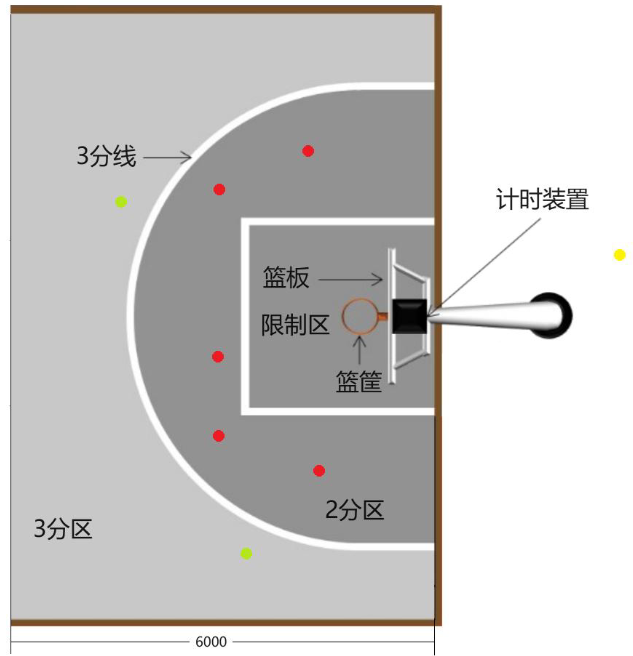

# Robocon 2025 飞身上篮 预选赛

## 赛题简介

对于投篮赛，如图所示，在 2 分区的地面上，随机贴了 5 个直径 80mm 的红色圆形背胶纸片，标示了机器人投篮的位置；在 3 分区的地面上，随机贴了 2 个直径 360mm 的浅绿色圆形背胶纸片，标示了机器人投篮的位置。投篮位置一经确定，在整个比赛中不再变化。比赛开始后，机器人可以在限制区扣篮，在 2 分区和 3 分区投篮。

## 项目说明

本项目用于为机器人提供对红色与绿色圆形背胶纸片的识别与定位功能。
